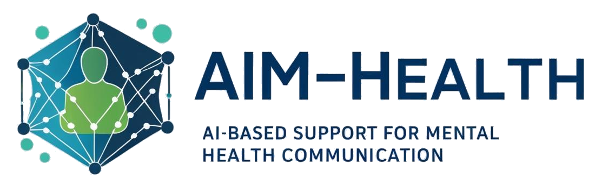

<!-- ## Row {height="50%"} -->

<!-- ## Row {height="50%"} -->

## About this project

AIM-Health is an international research project between Brazil and UK. It started on February 2025 and has an expected duration of three years.

::: {.panel-tabset}

#### Scope
**Depression** is a mental health disorder that affects a large portion of the global population, being the second largest contributor to decrease in healthy life expectancy. Depression is characterized by a clinically significant form of psychological suffering that leads to significant impairment in someone's functionality, reduced quality of life and, in severe cases, can lead to death due to the risk of suicide. However, according to the World Health Organization, only a quarter of individuals suffering from mental health disorders receive proper care. 

Advances in **Artificial Intelligence** (AI) and **Natural Language Processing** (NLP) research have been developed to a level that can be used for proposing computational solutions that assist in the detection and intervention in mental health conditions. AI and NLP based solutions that aid in the identification of signs of depression can be useful both in individual treatment and in making public policy decisions. Similarly, solutions that offer autonomous, ethical, reliable, controlled, and engaging intervention, in real time, can help mitigate the damage caused by depression. 

#### Goals 
This project works on proposing and developing AI and NLP based solutions for the **detection** and **intervention** of mental health conditions that can have a broader reach and allow mental health support to individuals and populations that would not otherwise have access to it. 

Furthermore, as social determinants are frequently mentioned as risk factors for mental health conditions, this project also aims at furthering the understanding about them in two contexts (Brazil and the United Kingdom). 

#### Scientific challenges
This project aims to address scientific challenges that are still present and very relevant in this context: 

* dealing with more abstract language (such as figurative language) commonly used in mental health self-narratives, and 
* outputting personalized interventions suitable for an individual's context.

:::

## Support agencies

This is an international project supported by FAPESP (24/10233-7) and the UKRI/MRC -- UK Research and Innovation / Medical Research Council.
