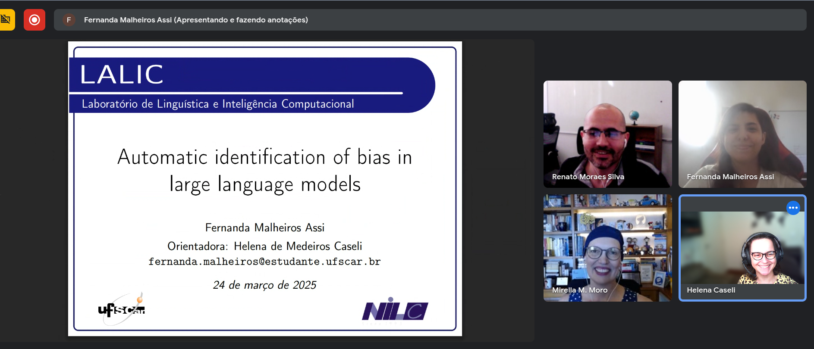

## Abstract
Large Language Models (LLMs) have demonstrated remarkable capabilities across various domains, from legal reasoning to clinical decision support. As these models become increasingly integrated into real-world applications, concerns about their reliability, fairness, and ethical implications have emerged. Studies have shown that LLMs can produce biased outputs, reinforcing harmful stereotypes and discriminating against marginalized groups. Among the most common biases are occupational stereotypes, racial disparities, and linguistic bias, where outputs vary based on the language or dialect used in the prompt. This study proposes a systematic framework to evaluate and rank LLMs based on their bias levels using the Elo rating system. A sentence completion framework will be employed, where models generate responses to prompts containing explicit social markers. The completions will be anonymized and scored using a regard classifier, which assesses how positively or negatively different demographic groups are portrayed. Pairwise comparisons will update Elo ratings, establishing a ranking of LLMs in terms of bias. This approach enables scalable and systematic comparisons across models.

<!--
Passo-a-passo para gerar o link:
1. Vai no arquivo do GDrive que tem o vídeo, manda abrir em uma nova aba
2. Vai nos "três pontinhos" e escolhe "Incorporar item"
3. Copia o conteúdo da janela
-->
## Video
<iframe src="https://drive.google.com/file/d/1zsJMC2yWOiwULKfRVEuiLg1LP3ryRe-d/preview" width="200" allow="autoplay"></iframe>

## Further information
The Master's Qualification Exam by Fernanda Malheiros Assi took place on March 24, 2025 and the commitee was composed of Professors Mirella Moro (Federal University of Minas Gerais, UFMG), Renato Silva (University of São Paulo, USP) and the advisor Helena Caseli (UFSCar).
