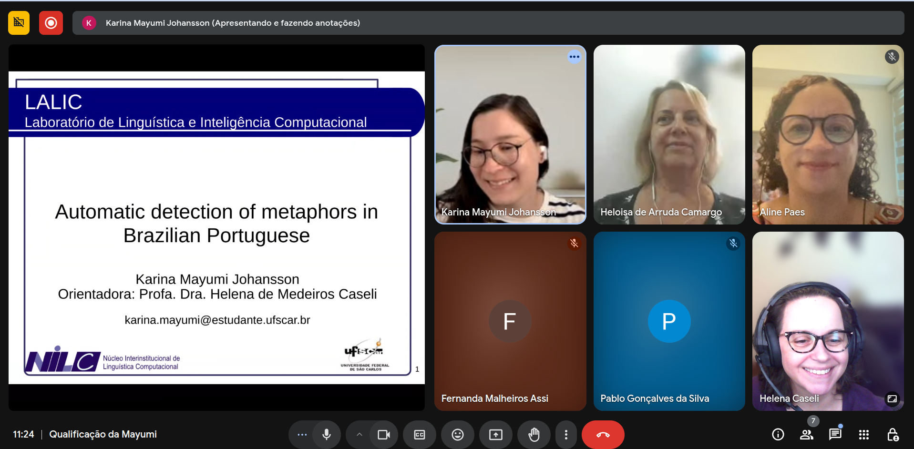

## Abstract
Automated metaphor processing plays a crucial role in various NLP applications, including sentiment analysis, machine translation, and text generation. Given the intricate nature of metaphorical language, its automatic processing poses a significant challenge, requiring models to go beyond literal meanings to capture underlying conceptual mappings. While significant research has been conducted on metaphor detection for high-resource languages like English, many other languages remain underexplored. This is particularly true for Brazilian Portuguese, where the scarcity of annotated datasets and limited studies hinder advancements in the field. This study aims to advance automated metaphor detection for Brazilian Portuguese by constructing an annotated dataset and training both monolingual and multilingual models for Brazilian Portuguese, English, and Spanish. The additional languages will be used to compare results and leverage knowledge to enhance generalization for the target language. By expanding research in this area, this work aims to strengthen the study of metaphor detection in Brazilian Portuguese and contribute to the broader development of NLP resources for the language.

<!--
Passo-a-passo para gerar o link:
1. Vai no arquivo do GDrive que tem o vídeo, manda abrir em uma nova aba
2. Vai nos "três pontinhos" e escolhe "Incorporar item"
3. Copia o conteúdo da janela
-->
## Video
<iframe src="https://drive.google.com/file/d/10IyuhVnfqw5BmG1AzligzlMokIID1c77/preview" width="200" allow="autoplay"></iframe>

## Further information
The Master's Qualification Exam by Karina Mayumi Johansson took place on April 4, 2025 and the commitee was composed of Professors Aline Paes(Federal University Fluminense, UFF), Heloísa de Arruda Camargo (UFSCar) and the advisor Helena Caseli (UFSCar).
