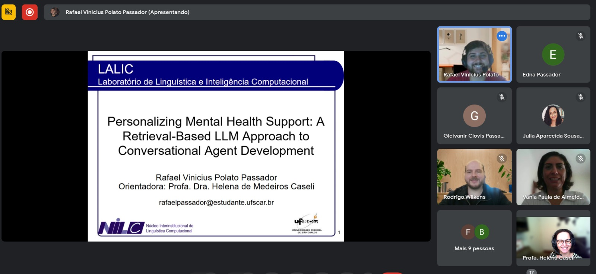

## Abstract
Mental health disorders pose significant challenges worldwide, necessitating accessible and scalable interventions. Conversational agents (CAs), or chatbots, have gained increasing attention as digital mental health tools, offering continuous support and reducing barriers to psychological assistance. While traditional rule-based and machine learning-based chatbots provide structured guidance, they often lack contextual adaptability and personalization, limiting their effectiveness in mental health applications. Large Language Models (LLMs), particularly when combined with Retrieval-Augmented Generation (RAG), offer a promising alternative by integrating domain-specific knowledge into chatbot responses, mitigating hallucinations, and improving factual grounding. This study aims to develop a personalized RAG-LLM chatbot tailored to Portuguese-speaking users, leveraging multilingual LLM capabilities and domain-adapted retrieval mechanisms. By retrieving specialized mental health data and incorporating user-specific information, the chatbot seeks to provide context-aware, empathetic, and personalized interventions. This research explores how integrating user history and specific domain knowledge enhances chatbot responses, ensuring that interactions dynamically adjust to the user’s psychological and emotional state.
Given the scarcity of mental health datasets in Portuguese, this work will utilize publicly available mental health resources alongside the Amive dataset, a specialized corpus containing structured behavioral and textual data relevant to psychological assessment. The evaluation of the chatbot will include quantitative assessments using standard NLP metrics and qualitative human evaluation to measure the model’s ability to generate clinically relevant and empathetic responses. By addressing hallucinations, contextual accuracy, and personalization, this research contributes to the advancement of AI-driven mental health support systems, particularly in underrepresented linguistic contexts.

<!--
Passo-a-passo para gerar o link:
1. Vai no arquivo do GDrive que tem o vídeo, manda abrir em uma nova aba
2. Vai nos "três pontinhos" e escolhe "Incorporar item"
3. Copia o conteúdo da janela
-->
## Video
<iframe src="https://drive.google.com/file/d/1-hnaCE1dn-b2EkpEIgCFJj1gDbQoEVP5/preview" width="200" allow="autoplay"></iframe>

## Further information
The Master's Qualification Exam by Rafael Vinicius Polato Passador took place on February 25, 2025 and the commitee was composed of Professors Rodrigo Wilkens (University of Exeter, UK), Vânia Paula de Almeida Neris (UFSCar) and the advisor Helena Caseli (UFSCar).
