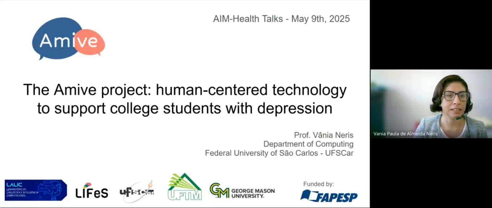

## Abstract
Depression is a significant mental health issue worldwide, and it affects college students more than the general population. While universities strive to support their students, technology can also play a crucial role. Computing technology can collect daily data, process it, and provide insights to both students and healthcare professionals. This includes physiological data gathered from wearable devices, as well as students' thoughts and feelings expressed through text. Furthermore, digital interventions can be delivered promptly as initial support. The Amive project is a Brazilian human-centered AI initiative aimed at developing a comprehensive solution that classifies data on various factors such as sleep quality, exercise habits, and heart rate monitoring. Additionally, it identifies depressive symptoms from text shared on social media and uses this information to engage with students through a chatbot. This talk will discuss the research that led to this solution, the challenges encountered, and future work planned.

## Video
<iframe src="https://drive.google.com/file/d/1FxmgIx-EN6gVPqbSrKlZI-gmWJgBIYqt/preview" height="200" allow="autoplay"></iframe>

## Short Bio
Vânia Neris is an Associate Professor in the Department of Computing at the Federal University of São Carlos (UFSCar) in Brazil, where she leads the Flexible and Sustainable Interaction Lab (LIFeS). She has been researching Human-Computer Interaction since 1999. She received her Ph. D. in Computer Science from the University of Campinas (UNICAMP)(2010) and has conducted research at the University of Reading (UK)(2008-2009). She was a Visiting Scholar in the Department of Information Sciences and Technology at George Mason University (2021-2022). She is a three-time recipient of the best paper award from the main Brazilian HCI conference. Prof. Neris has received research funding from several agencies in Brazil. Since 2011, she has been studying how to develop emotion-aware systems. Prof. Neris was one of the investigators of the Amive project, which aimed to identify possible depressive symptoms among college students and deliver appropriate interventions to them. Her actual research interests include: (1) computer support for mental health and well-being, (2) human-centred AI and (3) computer science education.

