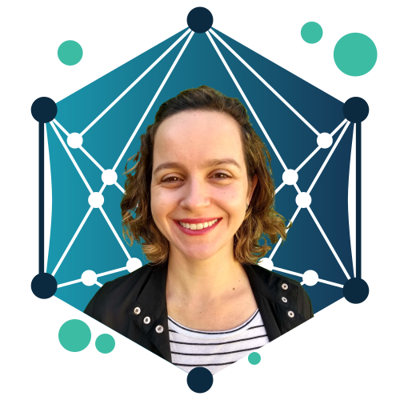
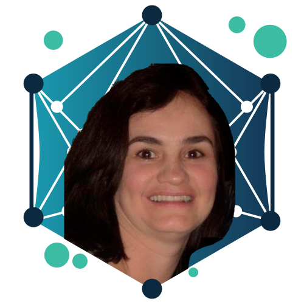
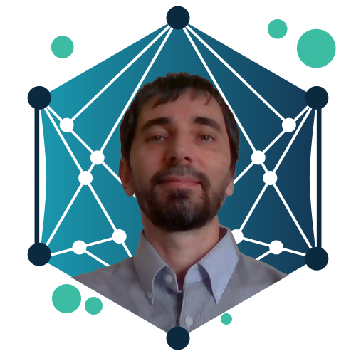
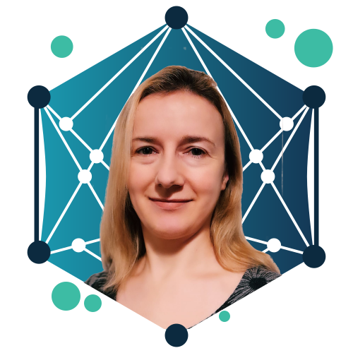
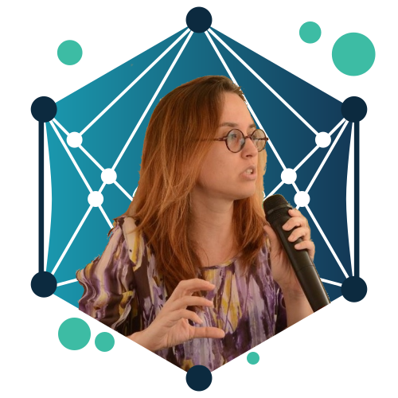
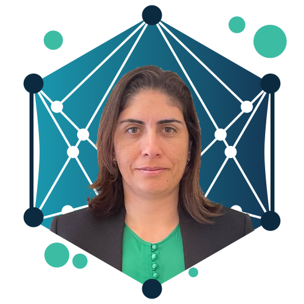
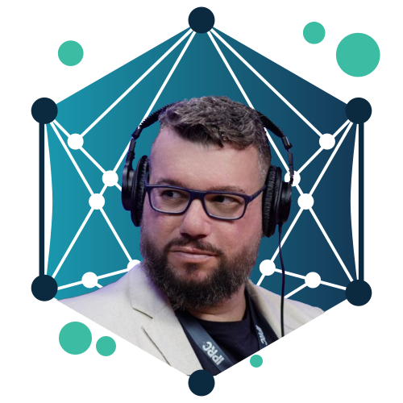
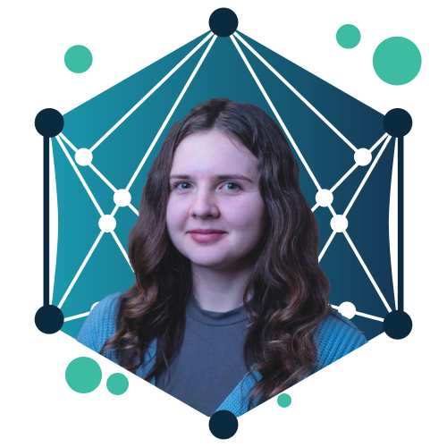
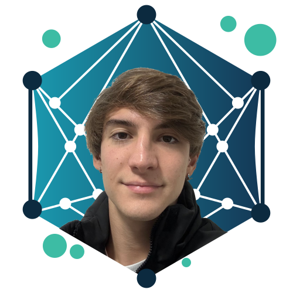
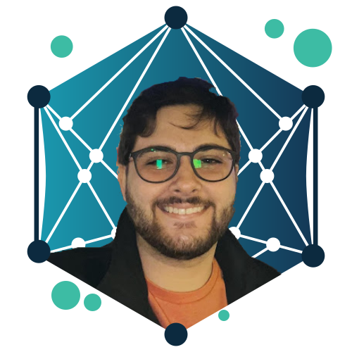

<!-- For each new member:

### NAME

:::: {layout="[ 20, 70 ]"}

::: {#first-column}
{fig-alt="NAME"}
:::

::: {#second-column}
SHORT BIO

[Email](mailto:EMAIL){.btn .btn-primary .btn-sm role="button" data-toggle="tooltip" title="EMAIL"}
[Personal Site](SITE){.btn .btn-primary .btn-sm role="button"}
[ORCID](ORCID){.btn .btn-primary .btn-sm role="button"}
[Google Scholar](GOOGLE SCHOLAR){.btn .btn-primary .btn-sm role="button"}
[CV Lattes](CV LATTES){.btn .btn-primary .btn-sm role="button"}
:::
::::

-->

## Coordinators

<!-- Aline Villavicencio --> 
### Prof. Dr. Aline Villavicencio 

:::: {layout="[ 20, 70 ]"}

::: {#first-column}
{fig-alt="Aline Villavicencio"}
:::

::: {#second-column}
Aline Villavicencio is the Director of the Institute of Data Science and Artificial Intelligence in the University of Exeter. She is the coordinator of AIM-Health project in UK. Her research on multiword expressions and figurative processing will contribute with the identification of potential areas of interest in AIM-Health project.

[Email](mailto:a.villavicencio@exeter.ac.uk){.btn .btn-primary .btn-sm role="button" data-toggle="tooltip" title="a.villavicencio@exeter.ac.uk"}
[Personal Site](https://sites.google.com/view/alinev){.btn .btn-primary .btn-sm role="button"}
[ORCID](https://orcid.org/0000-0002-3731-9168){.btn .btn-primary .btn-sm role="button"}
[Google Scholar](https://scholar.google.co.uk/citations?user=zbwPYqwAAAAJ&hl=en){.btn .btn-primary .btn-sm role="button"}
[CV Lattes](http://lattes.cnpq.br/4849566723209094){.btn .btn-primary .btn-sm role="button"}

:::

::::

<!-- Helena Caseli --> 
### Prof. Dr. Helena Caseli 

:::: {layout="[ 70, 20 ]"}

::: {#second-column}
Helena Caseli is a Full Professor at Federal University of São Carlos (UFSCar) and the coordinator of [LALIC](https://www.lalic.ufscar.br). She is the coordinator of AIM-Helath project in Brazil. She has a PhD in Computer Science and more than 25 years of research in Natural Language Processing (NLP). In this project, Dr. Caseli is supervising graduate and undergraduate students on themes related to NLP applied to mental health.

<!--[`helenacaseli@ufscar.br`](mailto:helenacaseli@ufscar.br)-->
[Email](mailto:helenacaseli@ufscar.br){.btn .btn-primary .btn-sm role="button" data-toggle="tooltip" title="helenacaseli@ufscar.br"}
[Google Scholar](https://scholar.google.com.br/citations?user=rIGbkQsAAAAJ&hl=pt-BR){.btn .btn-primary .btn-sm role="button"}
[CV Lattes](http://lattes.cnpq.br/6608582057810385){.btn .btn-primary .btn-sm role="button"}
:::

::: {#first-column}
{fig-alt="Helena Caseli"}
:::
::::

<!-- Rodrigo Souza Wilkens --> 
### Prof. Dr. Rodrigo Wilkens

:::: {layout="[ 20, 70 ]"}

::: {#first-column}
{fig-alt="Rodrigo Wilkens"}
:::

::: {#second-column}
Rodrigo Wilkens holds a PhD in Computer Science from UFRGS (Brazil) and, since then, had worked at the Université catholique de Louvain (Belgium), the University of Strasbourg (France) and the University of Essex (UK), <!--focusing on topics such as cognitive computational models, computer-assisted language learning, knowledge extraction, question-and-answering systems, information retrieval, knowledge representation, chatterbots, text classification and simplification, word embeddings and user modeling,--> in several NLP topics<!-- with a special emphasis on the English, Portuguese and French languages-->. Since 2024, he has held the position of Lecturer (assistant professor) at the University of Exeter (UK). With a strong background in NLP and machine learning, Dr. Wilkens will contribute to the development of the personalized conversational agent aimed at mental health.

[Email](mailto:r.wilkens@exeter.ac.uk){.btn .btn-primary .btn-sm role="button" data-toggle="tooltip" title="r.wilkens@exeter.ac.uk"}
[Personal Site](https://experts.exeter.ac.uk/43953-rodrigo-wilkens){.btn .btn-primary .btn-sm role="button"}
[ORCID](https://orcid.org/0000-0003-4366-1215){.btn .btn-primary .btn-sm role="button"}
[Google Scholar](https://scholar.google.com.br/citations?user=-sIkqlEAAAAJ&hl=en&oi=ao){.btn .btn-primary .btn-sm role="button"}
[CV Lattes](https://lattes.cnpq.br/6611273591257975){.btn .btn-primary .btn-sm role="button"}
:::
::::

## Researchers

<!-- Doretta Caramaschi 
### Prof. Dr. Doretta Caramaschi

:::: {layout="[ 70, 20 ]"}

::: {#second-column}
SHORT BIO

[Email](mailto:EMAIL){.btn .btn-primary .btn-sm role="button" data-toggle="tooltip" title="EMAIL"}
[Personal Site](SITE){.btn .btn-primary .btn-sm role="button"}
[ORCID](ORCID){.btn .btn-primary .btn-sm role="button"}
[Google Scholar](GOOGLE SCHOLAR){.btn .btn-primary .btn-sm role="button"}
[CV Lattes](CV LATTES){.btn .btn-primary .btn-sm role="button"}
:::

::: {#first-column}
{fig-alt="NAME"}
:::

::::--> 

<!-- Eloize Rossi Marques Seno 
### Prof. Dr. Eloize Seno

:::: {layout="[ 20, 70 ]"}

::: {#first-column}
{fig-alt="NAME"}
:::

::: {#second-column}
SHORT BIO

[Email](mailto:EMAIL){.btn .btn-primary .btn-sm role="button" data-toggle="tooltip" title="EMAIL"}
[Personal Site](SITE){.btn .btn-primary .btn-sm role="button"}
[ORCID](ORCID){.btn .btn-primary .btn-sm role="button"}
[Google Scholar](GOOGLE SCHOLAR){.btn .btn-primary .btn-sm role="button"}
[CV Lattes](CV LATTES){.btn .btn-primary .btn-sm role="button"}
:::
::::--> 

<!-- Heloísa Cristina Figueiredo Frizzo --> 
### Prof. Dr. Heloísa Frizzo

:::: {layout="[ 70, 20 ]"}

::: {#second-column}
Heloísa Cristina Figueiredo Frizzo is an occupational therapist <!-- (UFSCar, 1995), specialist in Health Informatics (UNIFESP, 2015), Acupuncture (IBRAM/RP, 2014), Hospital Administration (Centro Educacional São Camilo, 2004), master in Medical Sciences/Mental Health (FMRP/USP),--> with a PhD in Sciences <!--(Interunits Nursing/EEUSP/SP).--> and a Post-doctorate in Sciences, Technology and Society. <!-- (Gerontology Department/UFSCar).--> Dr. Frizzo is an Associate Professor <!--in the Department of Occupational Therapy-->at the Federal University of Triângulo Mineiro (UFTM, Brazil) <!--She worked as a Visiting Researcher/Observatory of Aging/Institute of Social Sciences/University of Lisbon/UL/Lisbon/Portugal. Member of the Editorial Board of the Journal Family, Life Cycles and Health in the Social Context and reviewer of the Journal of Occupational Therapy of the University of São Paulo, of the Brazilian Notebooks of Occupational Therapy, and of the Brazilian Interinstitutional Journal of Occupational Therapy. Effective Member and local representative of the Institutional Ethics Committee/UFTM. Founding member of the Scientific Association of Occupational Therapy in Hospital Contexts, member of the board and fiscal/deliberative councils of the Scientific Association of Occupational Therapy in Hospital Contexts/ATOHosp, biennia 2012/2014; 2014/2016; 2017/2019, 2019/2021, respectively. Evaluator of health residency programs of the Ministry of Education. Leader of the Research Group: Interdisciplinary Center in Technologies in Everyday Life - NIPTecC/UFTM. Member of the Research Group: Translational Mental Health/UFSCar/DMe.--> and collaborates with the Postgraduate Programs in Psychology/UFTM<!--(Academic Master's Degree), collaborator of the Postgraduate Program-->, in Clinical Management/UFSCar <!--(Professional Master's Degree), Strict Sensu Specialization Course in Palliative Care/UFSCar and Strict Sensu and the Specialization Course--> and in Mental Health/University of Uberaba. 
<!--In the research: AI-based support for communication in mental health (AIM-Health) I am--> In this project, she will <!-- be working as a mental health specialist collaborating -->  collaborate in the production of personalized interventions for the individual's context.

[Email](mailto:heloisa.frizzo@gmail.com){.btn .btn-primary .btn-sm role="button" data-toggle="tooltip" title="heloisa.frizzo@gmail.com"}
<!--[Personal Site](SITE){.btn .btn-primary .btn-sm role="button"}-->
[ORCID](https://orcid.org/0000-0002-7661-0353){.btn .btn-primary .btn-sm role="button"}
[Google Scholar](https://scholar.google.com.br/citations?user=MFRWPyUAAAAJ&hl=pt-BR){.btn .btn-primary .btn-sm role="button"}
[CV Lattes](http://lattes.cnpq.br/7671727745372896){.btn .btn-primary .btn-sm role="button"}
:::

::: {#first-column}
{fig-alt="Heloísa Frizzo"}
:::

::::

<!-- Ivandré Paraboni --> 
### Prof. Dr. Ivandré Paraboni

:::: {layout="[ 20, 70 ]"}

::: {#first-column}
{fig-alt="Ivandré Paraboni"}
:::

::: {#second-column}
Ivandré Paraboni is an Associate Professor at University of São Paulo State (USP). In this project, Dr. Paraboni will collaborate with prompt-based methods for the detection of signs of depression from social media text.

[Email](mailto:ivandre@usp.br){.btn .btn-primary .btn-sm role="button" data-toggle="tooltip" title="ivandre@usp.br"}
[Personal Site](https://ivandreparaboni.wixsite.com/research){.btn .btn-primary .btn-sm role="button"}
[ORCID](https://orcid.org/0000-0002-7270-1477){.btn .btn-primary .btn-sm role="button"}
[Google Scholar](https://scholar.google.com/citations?authuser=2&user=77zWMtcAAAAJ){.btn .btn-primary .btn-sm role="button"}
[CV Lattes](http://lattes.cnpq.br/4979536048261282){.btn .btn-primary .btn-sm role="button"}
:::
::::

<!-- Ke Li --> 
### Prof. Dr. Ke Li

:::: {layout="[ 70, 20 ]"}

::: {#second-column}
Ke Li is an UKRI Future Leaders Fellow, a Turing Fellow, and a Reader in Computer Science at the University of Exeter. His research has contributed to the fundamental development of computational/artificial intelligence (CI/AI) for black-box optimisation and decision-making (especially with multiple conflicting objectives), as well as their applications in software engineering, renewable energy, and life sciences. 
<!--I have published over 140 papers, nearly half of which are as the first/single author. These include 41 papers in prestigious IEEE/ACM Transactions and over 40 papers in top conferences across AI (e.g., NeurIPS, CVPR, AAAI, IJCAI), natural language processing (e.g., ACL, EMNLP), and software engineering (ICSE, FSE, ASE, ISSTA). Eight of my articles are in the ESI top 1% highly cited papers. One work[1] has been ranked #1 in ‘Journal Impact Factor contributing items’ for IEEE Transactions on Evolutionary Computation (TEVC) by Clarivate Analytics in 2017. Two works[1][2] have been nominated for the prestigious TEVC Outstanding Paper Award in 2016 and 2017. Since 2020, I have been recognised in the Stanford list of top 2% of the world most-cited scientists. I have secured nearly £4m grant funding from esteemed bodies, e.g., UKRI, Royal Society, EPSRC, ERC, EU Horizon, Hong Kong RGC, and NSFC (China). My key research contributions related to this Faraday Discovery Fellowship proposal are summarised in the following four aspects. -->

[Email](mailto:k.li@exeter.ac.uk){.btn .btn-primary .btn-sm role="button" data-toggle="tooltip" title="k.li@exeter.ac.uk"}
[Personal Site](https://colalab.ai/){.btn .btn-primary .btn-sm role="button"}
<!--[ORCID](ORCID){.btn .btn-primary .btn-sm role="button"}-->
[Google Scholar](https://scholar.google.com/citations?user=lUFU8KsAAAAJ&hl=en){.btn .btn-primary .btn-sm role="button"}
<!--[CV Lattes](CV LATTES){.btn .btn-primary .btn-sm role="button"}-->
:::

::: {#first-column}
{fig-alt="Ke Li"}
:::

::::

<!-- Kim Wright --> 
### Prof. Dr. Kim Wright

:::: {layout="[ 20, 70 ]"}

::: {#first-column}
{fig-alt="Kim Wright"}
:::

::: {#second-column}
Kim Wright is Professor of Clinical Psychology at the University of Exeter. She specialises in the development and evaluation of psychological interventions for people with mood disorders, and is advising on clinical aspects of the project.

[Email](mailto:K.A.Wright@exeter.ac.uk){.btn .btn-primary .btn-sm role="button" data-toggle="tooltip" title="K.A.Wright@exeter.ac.uk"}
[Personal Site](https://experts.exeter.ac.uk/1027-kim-wright){.btn .btn-primary .btn-sm role="button"}
[ORCID](https://orcid.org/0000-0003-3865-9743){.btn .btn-primary .btn-sm role="button"}
[Google Scholar](https://scholar.google.co.uk/citations?user=Jd-uOA8AAAAJ&hl=en&oi=ao){.btn .btn-primary .btn-sm role="button"}
<!--[CV Lattes](CV LATTES){.btn .btn-primary .btn-sm role="button"}-->
:::
::::

<!-- Sylvia Iasulaits 
### Prof. Dr. Sylvia Iasulaits

:::: {layout="[ 70, 20 ]"}

::: {#second-column}
SHORT BIO

:::

::: {#first-column}
{fig-alt="NOME"}
:::

::::--> 

<!-- Taís Bleicher -->

### Prof. Dr. Taís Bleicher

:::: {layout="[ 20, 70 ]"}

::: {#first-column}
{fig-alt="Taís Bleicher"}
:::

::: {#second-column}
Taís Bleicher is a Professor at Universidade Federal de São Carlos (UFSCar). Dr. Bleicher is a psychologist with a master’s degree in Clinical Psychology and Culture, a PhD in Public Health, and a postdoctoral degree in Nursing. She has been working in Psychosocial Care since 2007 and in Student Assistance since 2008. Since 2021, she has been conducting research at the intersection of Psychosocial Care and Computing.

[Email](mailto:tbleicher@ufscar.br){.btn .btn-primary .btn-sm role="button" data-toggle="tooltip" title="tbleicher@ufscar.br"}
<!--[Personal Site](SITE){.btn .btn-primary .btn-sm role="button"} -->
[ORCID](https://orcid.org/0000-0002-0056-3749){.btn .btn-primary .btn-sm role="button"}
[Google Scholar](https://scholar.google.com/citations?user=ljwYAlQAAAAJ&hl=pt-BR&oi=ao){.btn .btn-primary .btn-sm role="button"}
[CV Lattes](http://lattes.cnpq.br/9075358493860166){.btn .btn-primary .btn-sm role="button"}
:::
::::

<!-- Vânia Paula de Almeida Neris  --> 
### Prof. Dr. Vânia Neris 

:::: {layout="[ 70, 20 ]"}

::: {#second-column}
Vânia Neris is an Associate Professor in the Department of Computing at <!--the Federal University of São Carlos--> UFSCar, in Brazil, where she leads the Flexible and Sustainable Interaction Lab (LIFeS). She received her Ph. D. in Computer Science from the University of Campinas (Brazil), has conducted research at the University of Reading (UK), and was a visiting scholar at George Mason University (USA). Her research interests include emotion-aware systems and computing technology for mental health and well-being. In this project, she is responsible for studies on the chatbot personalization.

[Email](mailto:vania.neris@ufscar.br){.btn .btn-primary .btn-sm role="button" data-toggle="tooltip" title="vania.neris@ufscar.br"}
<!--[Personal Site](SITE){.btn .btn-primary .btn-sm role="button"}-->
[ORCID](https://orcid.org/0000-0002-4059-8700){.btn .btn-primary .btn-sm role="button"}
[Google Scholar](https://scholar.google.com/citations?user=rzONokcAAAAJ&hl=pt-BR){.btn .btn-primary .btn-sm role="button"}
[CV Lattes](http://lattes.cnpq.br/0268728255033469){.btn .btn-primary .btn-sm role="button"}
:::

::: {#first-column}
{fig-alt="Vânia Neris"}
:::

::::

<!-- STUDENTS -->

## Students

<!-- Caio Vitor Soares: TT-1 05/2025-10/2025 
### Caio Vitor Soares

:::: {layout="[ 20, 70 ]"}

::: {#first-column}
{fig-alt="NAME"}
:::

::: {#second-column}
SHORT BIO

[Email](mailto:EMAIL){.btn .btn-primary .btn-sm role="button" data-toggle="tooltip" title="EMAIL"}
[Personal Site](SITE){.btn .btn-primary .btn-sm role="button"}
[ORCID](ORCID){.btn .btn-primary .btn-sm role="button"}
[Google Scholar](GOOGLE SCHOLAR){.btn .btn-primary .btn-sm role="button"}
[CV Lattes](CV LATTES){.btn .btn-primary .btn-sm role="button"}
:::
::::-->

<!-- David Leonardo Barsand de Leucas: Doutorando da Sylvia 2025-2028 -->
### David Leucas

:::: {layout="[ 70, 20 ]"}

::: {#first-column}
David Leucas is a PhD student in Science, Technology, and Society (UFSCar), with a Master’s degree in Philosophy (UFRJ), a specialization in Neuropsychology (UVAM), and a background in Psychology. Currently conducting research in Affective Computing, focusing on the potential for emotional connections between humans and large language models (LLMs).

[Email](mailto:david.leucas@estudante.ufscar.br){.btn .btn-primary .btn-sm role="button" data-toggle="tooltip" title="david.leucas@estudante.ufscar.br"}
<!--[Personal Site](SITE){.btn .btn-primary .btn-sm role="button"}-->
[ORCID](https://orcid.org/0000-0002-6979-5249){.btn .btn-primary .btn-sm role="button"}
[Google Scholar](https://scholar.google.com.br/citations?user=9M8ci-4AAAAJ&hl=pt-BR&authuser=1){.btn .btn-primary .btn-sm role="button"}
[CV Lattes](http://lattes.cnpq.br/1460698152896760){.btn .btn-primary .btn-sm role="button"}
:::

::: {#second-column}
{fig-alt="David Leucas"}
:::
::::

<!-- Diana Kylymnyk: Doutoranda da Aline -->
### Diana Kylymnyk

:::: {layout="[ 20, 70 ]"}

::: {#first-column}
{fig-alt="Diana Kylymnyk"}
:::

::: {#second-column}
Diana Kylymnyk is a PhD Student in Computer Science and Psychology at the University of Exeter.
My research explores how Natural Language Processing (NLP) can support and enhance digital mental health interventions. I focus on analyzing text data from online Cognitive Behavioral Therapy (CBT) platforms to better understand therapeutic progress, user engagement, and treatment outcomes.

[Email](mailto:dk500@exeter.ac.uk){.btn .btn-primary .btn-sm role="button" data-toggle="tooltip" title="dk500@exeter.ac.uk"}
<!--Personal Site](https://researchpubs.exeter.ac.uk/userprofile.html?uid=45091){.btn .btn-primary .btn-sm role="button"}-->
[ORCID](https://orcid.org/0009-0006-7682-733X){.btn .btn-primary .btn-sm role="button"}
[Google Scholar](https://scholar.google.com/citations?user=EZZd2mYAAAAJ&hl=en&authuser=1){.btn .btn-primary .btn-sm role="button"}
<!--[CV Lattes](CV LATTES){.btn .btn-primary .btn-sm role="button"}-->
:::
::::

<!-- Diogo Conforti Vaz Bellini: TT-1 05/2025-10/2025 -->
### Diogo Conforti Vaz Bellini

:::: {layout="[ 70, 20 ]"}

::: {#first-column}
Diogo Bellini is an undergraduate Computer Science student at the Federal University of São Carlos since 2023, focusing his studies on the field of Artificial Intelligence. In the AIM-Health project, he is developing a module to classify symptoms of depression in social media posts that also take into account the presence of figurative language, such as metaphors and similes, to express the symptoms. <!--Because of this, I am using machine learning techniques based on multi-task learning to improve classification performance, as demonstrated by the Yadav et al. article “Identifying Depressive Symptoms from Tweets: Figurative Language Enabled Multitask Learning Framework,” which showed promising results.-->

[Email](mailto:diogobellini@estudante.ufscar.br){.btn .btn-primary .btn-sm role="button" data-toggle="tooltip" title="diogobellini@estudante.ufscar.br"}
<!--[Personal Site](SITE){.btn .btn-primary .btn-sm role="button"}-->
[ORCID](https://orcid.org/0009-0000-6824-0658){.btn .btn-primary .btn-sm role="button"}
<!--[Google Scholar](GOOGLE SCHOLAR){.btn .btn-primary .btn-sm role="button"}-->
[CV Lattes](http://lattes.cnpq.br/2036735857577618){.btn .btn-primary .btn-sm role="button"}
:::

::: {#second-column}
{fig-alt="Diogo Bellini"}
:::
::::

<!-- Fernanda Malheiros Assi: Mestranda da Helena 2025-2026 
### Fernanda Malheiros Assi

:::: {layout="[ 20, 70 ]"}

::: {#first-column}
{fig-alt="NAME"}
:::

::: {#second-column}
SHORT BIO

[Email](mailto:EMAIL){.btn .btn-primary .btn-sm role="button" data-toggle="tooltip" title="EMAIL"}
[Personal Site](SITE){.btn .btn-primary .btn-sm role="button"}
[ORCID](ORCID){.btn .btn-primary .btn-sm role="button"}
[Google Scholar](GOOGLE SCHOLAR){.btn .btn-primary .btn-sm role="button"}
[CV Lattes](CV LATTES){.btn .btn-primary .btn-sm role="button"}
:::
::::-->

<!-- Gabriel Lino Garcia: Doutorando do João Paulo Papa 2025 -->
### Gabriel Lino Garcia

:::: {layout="[ 70, 20 ]"}

::: {#second-column}
Gabriel Garcia is a PhD student in computer science with application in natural language processing. In AIM-Health project he is working as a co-supervisor of undergraduate students.

[Email](mailto:gabriel.lino@unesp.br){.btn .btn-primary .btn-sm role="button" data-toggle="tooltip" title="gabriel.lino@unesp.br"}
<!--[Personal Site](SITE){.btn .btn-primary .btn-sm role="button"}-->
[ORCID](https://orcid.org/0000-0003-1236-7929){.btn .btn-primary .btn-sm role="button"}
[Google Scholar](https://scholar.google.com.br/citations?user=51Du30IAAAAJ&hl=pt-BR){.btn .btn-primary .btn-sm role="button"}
[CV Lattes](http://lattes.cnpq.br/1435933377049978){.btn .btn-primary .btn-sm role="button"}
:::

::: {#first-column}
{fig-alt="NAME"}
:::
::::

<!-- Grasiane Cristina da Silva: Doutoranda da Vânia 2025-2028 
### Grasiane Cristina da Silva

:::: {layout="[ 20, 70 ]"}

::: {#first-column}
{fig-alt="NAME"}
:::

::: {#second-column}
SHORT BIO

[Email](mailto:EMAIL){.btn .btn-primary .btn-sm role="button" data-toggle="tooltip" title="EMAIL"}
[Personal Site](SITE){.btn .btn-primary .btn-sm role="button"}
[ORCID](ORCID){.btn .btn-primary .btn-sm role="button"}
[Google Scholar](GOOGLE SCHOLAR){.btn .btn-primary .btn-sm role="button"}
[CV Lattes](CV LATTES){.btn .btn-primary .btn-sm role="button"}
:::
::::-->

<!-- Karina Mayumi Johansson: Mestranda da Helena 2025-2026 
### Karina Mayumi Johansson

:::: {layout="[ 70, 20 ]"}

::: {#second-column}
SHORT BIO

[Email](mailto:EMAIL){.btn .btn-primary .btn-sm role="button" data-toggle="tooltip" title="EMAIL"}
[Personal Site](SITE){.btn .btn-primary .btn-sm role="button"}
[ORCID](ORCID){.btn .btn-primary .btn-sm role="button"}
[Google Scholar](GOOGLE SCHOLAR){.btn .btn-primary .btn-sm role="button"}
[CV Lattes](CV LATTES){.btn .btn-primary .btn-sm role="button"}
:::

::: {#first-column}
{fig-alt="NAME"}
:::
::::-->

<!-- Rafael Vinicius Polato Passador: Mestrando da Helena 2025-2026 -->
### Rafael Vinicius Polato Passador

:::: {layout="[ 20, 70 ]"}

::: {#first-column}
{fig-alt="Rafael Passador"}
:::

::: {#second-column}
Rafael Passador is a Master’s student in the field of Machine Learning and Natural Language Processing at the Federal University of São Carlos (UFSCar). He works on exploring Large Language Models (LLMs) and Retrieval-Augmented Generation (RAG) techniques to develop a personalized conversational agent for individuals with mental health disorders.

[Email](mailto:rafaelpassador1999@gmail.com){.btn .btn-primary .btn-sm role="button" data-toggle="tooltip" title="rafaelpassador1999@gmail.com"}
<!--[Personal Site](SITE){.btn .btn-primary .btn-sm role="button"}-->
<!--[ORCID](ORCID){.btn .btn-primary .btn-sm role="button"}-->
[Google Scholar](https://scholar.google.com/citations?user=eQjPTF8AAAAJ&hl=pt-BR){.btn .btn-primary .btn-sm role="button"}
[CV Lattes](http://lattes.cnpq.br/8275474576606344){.btn .btn-primary .btn-sm role="button"}
:::
::::

<!-- Vitória Hilgert Tomasel: TT-1 05/2025-10/2025 
### Vitória Hilgert Tomasel

:::: {layout="[ 70, 20 ]"}

::: {#second-column}
SHORT BIO

[Email](mailto:EMAIL){.btn .btn-primary .btn-sm role="button" data-toggle="tooltip" title="EMAIL"}
[Personal Site](SITE){.btn .btn-primary .btn-sm role="button"}
[ORCID](ORCID){.btn .btn-primary .btn-sm role="button"}
[Google Scholar](GOOGLE SCHOLAR){.btn .btn-primary .btn-sm role="button"}
[CV Lattes](CV LATTES){.btn .btn-primary .btn-sm role="button"}
:::

::: {#first-column}
{fig-alt="NAME"}
:::
::::-->

